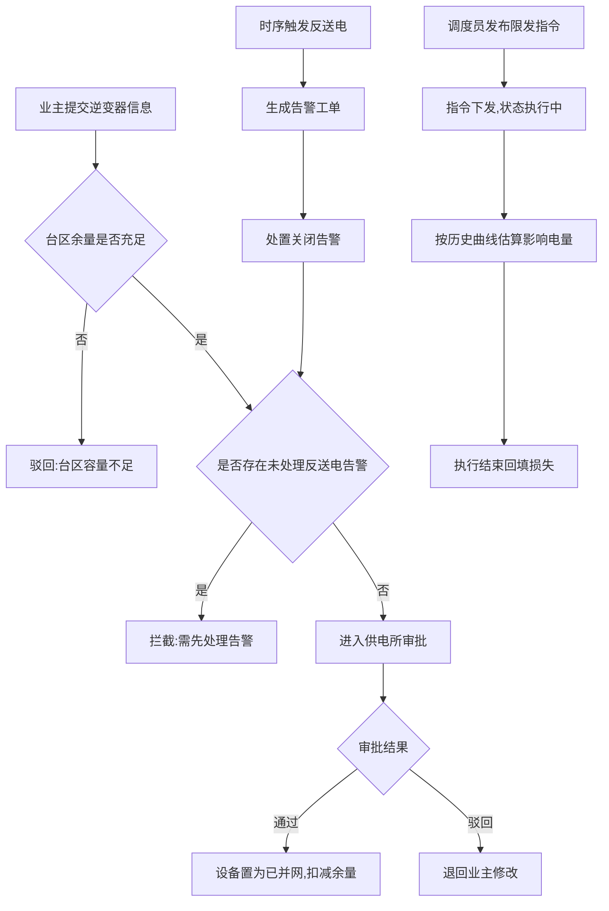

# 分布式光伏消纳管理系统 产品需求文档（PRD）

## 1. 产品概述

分布式光伏消纳管理系统面向供电所、分布式光伏业主与电网调度员，将「业主申报—并网容量—反送电告警—限发执行」四条业务线串联为闭环：以台区容量为安全基线审批并网，以反送电告警未处理作为扩容卡点，以限发指令量化消纳缺口与影响电量。系统目标是提升台区消纳率、杜绝超容量并网、压降反送电风险、让限发影响可估算可追溯。

- 目标用户：供电所人员、光伏业主、调度员、系统管理员
- 价值：规范化并网审批、告警闭环、限发影响可量化、为消纳分析提供数据底座

## 2. 核心功能

### 2.1 用户角色

| 角色 | 注册方式 | 核心权限 |
|------|----------|----------|
| 供电所人员 | 管理员分配账号 | 录入/维护台区容量、审核并网与扩容申报 |
| 光伏业主 | 手机号注册 | 提交逆变器信息、申报并网/扩容、查看申报进度 |
| 调度员 | 管理员分配账号 | 发布限发指令、查看执行情况与影响电量 |
| 系统管理员 | 系统预置 | 用户与角色管理、参数与阈值配置 |

### 2.2 功能模块

1. **综合驾驶舱**：台区容量总览、反送电告警态势、限发执行看板、电量估算曲线
2. **台区管理**：台区容量录入与余量监控、关联设备清单、消纳率
3. **业主申报**：逆变器信息提交、并网/扩容审批流、容量校验与卡点提示
4. **反送电告警**：告警列表与详情、处理工单、扩容卡点联动
5. **限发执行**：限发指令发布、执行监控、影响电量估算
6. **电量分析**：时序功率曲线、限发损失统计、台区消纳对比

### 2.3 页面详情

| 页面名称 | 模块名称 | 功能描述 |
|----------|----------|----------|
| 综合驾驶舱 | 容量总览卡 | 各台区已并网/总容量、余量进度条、超容预警 |
| 综合驾驶舱 | 告警态势 | 反送电告警计数、未处理高亮、趋势迷你图 |
| 综合驾驶舱 | 限发看板 | 当前生效指令、受影响台区、执行倒计时 |
| 综合驾驶舱 | 电量估算曲线 | ECharts 双轴：发电量与限发损失分时曲线 |
| 台区管理 | 容量录入 | 供电所录入/修改台区额定容量与消纳阈值 |
| 台区管理 | 余量监控 | 容量-已并网-审批中-余量瀑布图 |
| 台区管理 | 设备清单 | 台区下逆变器明细与并网状态 |
| 业主申报 | 逆变器信息表单 | 型号、额定功率、接入相位、安装位置 |
| 业主申报 | 申报提交 | 选择台区发起并网/扩容申报 |
| 业主申报 | 审批工作台 | 供电所审批，容量不足自动拦截并提示 |
| 反送电告警 | 告警列表 | 按台区/时间/状态筛选，等级标识 |
| 反送电告警 | 处理工单 | 核实、处置、关闭，留痕 |
| 反送电告警 | 扩容卡点 | 未处理告警拦截扩容并提示处理路径 |
| 限发执行 | 指令发布 | 选台区、限发比例、生效起止时段 |
| 限发执行 | 执行监控 | 指令状态、下发回执、实时功率对比 |
| 限发执行 | 影响电量估算 | 按比例与历史同时段曲线估算损失电量 |
| 电量分析 | 时序曲线 | 发电/反送/限发功率分时曲线 |
| 电量分析 | 损失统计 | 限发损失汇总、台区消纳对比、导出 |

## 3. 核心流程

### 3.1 并网审批流程
业主提交逆变器信息发起申报 → 系统校验台区余量 → 余量不足直接驳回并提示「台区容量不足」→ 余量充足进入供电所审批 → 审批通过后设备状态置为已并网并扣减台区余量 → 全程留痕。

### 3.2 扩容卡点流程
业主发起扩容申报 → 系统检查该台区是否存在未处理反送电告警 → 存在则拦截并提示「需先处理告警」→ 无未处理告警且余量充足进入审批。

### 3.3 限发执行流程
调度员选择台区发布限发指令（比例+时段）→ 指令下发并置为执行中 → 系统按比例与历史同时段发电曲线估算影响电量 → 执行结束回填实际执行与损失。

### 3.4 告警处理流程
时序数据触发反送电 → 生成告警工单 → 台区标记告警待处理 → 调度/供电所核实处置 → 关闭告警解除扩容卡点。

## 4. 用户界面设计

### 4.1 设计风格
- 主题：深色「电网调度控制室」工业风，强调数据密度与态势感知
- 配色：深空蓝底 `#0A1222` / 面板 `#111E33`；光伏绿主色 `#2EE6A6`；告警琥珀 `#FFB020`；危险红 `#FF4D4F`；数据青 `#38BDF8`
- 字体：标题 Chakra Petch（几何技术感）；数据/数值 IBM Plex Mono（等宽工业）；正文 Noto Sans SC
- 按钮：微圆角（6px），主按钮光伏绿带辉光投影，次按钮描边态
- 布局：顶部导航栏 + 左侧菜单 + 卡片网格 + 数据表格，栅格化信息墙
- 图标：Lucide 线性图标，告警/限发用色彩与徽章区分

### 4.2 页面设计概述

| 页面名称 | 模块名称 | UI 元素（样式/布局/配色/字体/动画） |
|----------|----------|----------|
| 综合驾驶舱 | 四宫格 KPI | 深色卡 + 绿色辉光数值，加载时数字递增动画 |
| 综合驾驶舱 | 电量估算曲线 | ECharts 渐变面积图，悬停十字线 |
| 台区管理 | 余量瀑布 | 横向条形 + 余量进度环 |
| 业主申报 | 审批工作台 | 表格 + 行内状态徽章，容量不足行标红 |
| 反送电告警 | 告警列表 | 等级色条 + 未处理脉冲动画 |
| 限发执行 | 影响估算 | 估算损失卡 + 历史对比柱状 |

### 4.3 响应式
桌面优先，1280px 及以上最佳体验；平板（≥768px）自适应收缩侧栏为图标态；触控目标≥40px。

### 4.4 3D 场景
本系统不涉及 3D 场景，以 2D 数据可视化为主。
