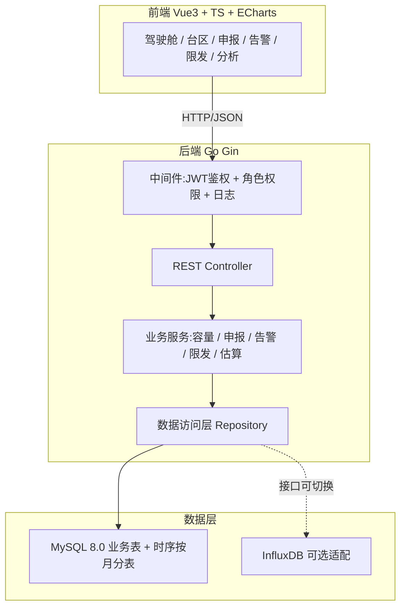
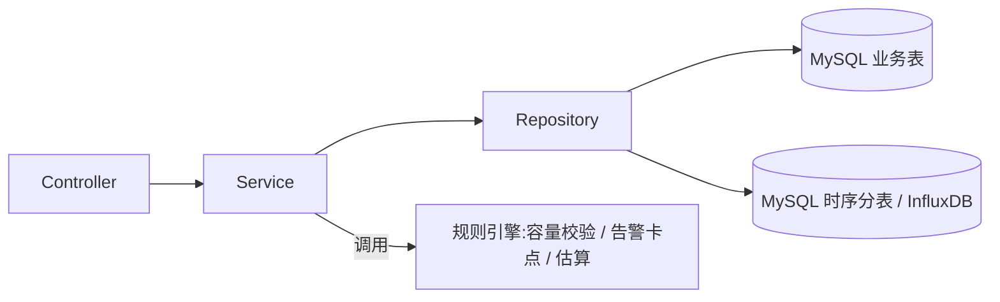
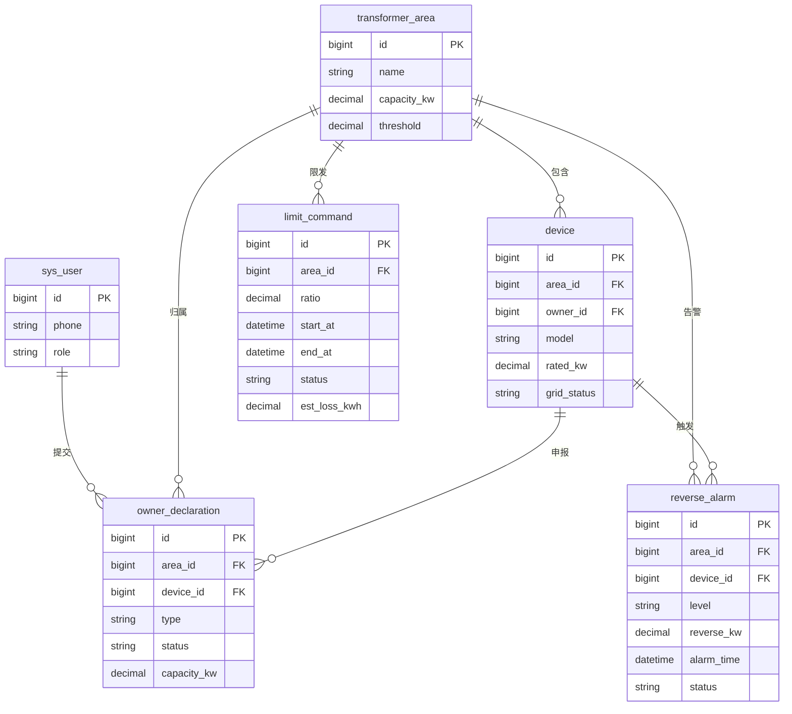

# 分布式光伏消纳管理系统 技术架构文档

## 1. 架构设计



## 2. 技术说明
- 前端：Vue@3 + TypeScript + Vite + ECharts@5 + Pinia + Vue Router + TailwindCSS
- 初始化工具：`npm create vite@latest`
- 后端：Go 1.22 + Gin + GORM + jwt-go
- 数据库：MySQL 8.0（台区/设备/告警/指令业务表 + 功率时序按月分表 `power_readings_yyyymm`）
- 可选：InfluxDB 通过 `TimeSeriesRepository` 接口适配，基础时序先落 MySQL 分表
- 端口：前端 dev `5173`、后端 `8080`、MySQL `3306`

## 3. 路由定义（前端）

| 路由 | 用途 |
|------|------|
| `/login` | 登录 |
| `/dashboard` | 综合驾驶舱 |
| `/areas` | 台区管理列表 |
| `/areas/:id` | 台区详情（容量/设备/余量） |
| `/declarations` | 业主申报列表 |
| `/declarations/new` | 新建申报（逆变器信息） |
| `/declarations/approve` | 供电所审批工作台 |
| `/alarms` | 反送电告警列表 |
| `/alarms/:id` | 告警详情与处理 |
| `/limits` | 限发指令列表 |
| `/limits/new` | 发布限发指令 |
| `/limits/:id` | 限发执行与影响估算 |
| `/analysis` | 电量分析 |

## 4. API 定义

### 4.1 鉴权
```go
type LoginReq struct {
    Phone    string `json:"phone"`
    Password string `json:"password"`
}
type LoginResp struct {
    Token string `json:"token"`
    User  User   `json:"user"`
}
```

### 4.2 台区
```go
type Area struct {
    ID         uint64  `json:"id"`
    Name       string  `json:"name"`
    CapacityKW float64 `json:"capacity_kw"`      // 额定容量 kW
    Threshold  float64 `json:"threshold"`         // 消纳安全阈值 0-1
    OrgName    string  `json:"org_name"`
}
// POST /api/areas  GET /api/areas  PUT /api/areas/:id
```

### 4.3 设备/申报
```go
type Device struct {
    ID          uint64  `json:"id"`
    AreaID      uint64  `json:"area_id"`
    OwnerID     uint64  `json:"owner_id"`
    Model       string  `json:"model"`
    RatedKW     float64 `json:"rated_kw"`
    Phase       string  `json:"phase"`           // A/B/C/ABC
    GridStatus  string  `json:"grid_status"`     // pending/grid/rejected
}
type Declaration struct {
    ID        uint64  `json:"id"`
    AreaID    uint64  `json:"area_id"`
    DeviceID  uint64  `json:"device_id"`
    Type      string  `json:"type"`              // grid/expand
    Status    string  `json:"status"`            // pending/approved/rejected
    CapacityKW float64 `json:"capacity_kw"`
}
// POST /api/declarations                 创建申报（触发容量+告警校验）
// POST /api/declarations/:id/approve     审批通过（扣减余量）
// POST /api/declarations/:id/reject      驳回
```

### 4.4 反送电告警
```go
type Alarm struct {
    ID        uint64    `json:"id"`
    AreaID    uint64    `json:"area_id"`
    DeviceID  uint64    `json:"device_id"`
    Level     string    `json:"level"`           // warn/danger
    ReverseKW float64   `json:"reverse_kw"`
    AlarmTime time.Time `json:"alarm_time"`
    Status    string    `json:"status"`          // open/handled/closed
}
// GET /api/alarms  POST /api/alarms/:id/handle
```

### 4.5 限发指令与影响估算
```go
type LimitCommand struct {
    ID         uint64    `json:"id"`
    AreaID     uint64    `json:"area_id"`
    Ratio      float64   `json:"ratio"`          // 限发比例 0-1
    StartAt    time.Time `json:"start_at"`
    EndAt      time.Time `json:"end_at"`
    Status     string    `json:"status"`         // executing/done/canceled
    EstLossKWh float64   `json:"est_loss_kwh"`   // 估算损失电量
}
// POST /api/limits                 发布限发指令
// GET  /api/limits                 指令列表
// GET  /api/limits/:id/impact      影响电量估算
```

### 4.6 时序
```go
// GET /api/timeseries?area_id=&metric=gen|reverse&from=&to=
type Point struct { Ts int64   `json:"ts"`; V  float64 `json:"v"` }
```

## 5. 服务架构图



业务规则落点：
- 容量校验：`DeclarationService.Create` 审批通过前 `SUM(已并网容量)+申报容量 ≤ Area.Capacity×Threshold`，不足返回 `capacity_insufficient`。
- 告警卡点：扩容申报时检查 `reverse_alarm WHERE area_id=? AND status<>'closed'`，存在则返回 `alarm_unhandled`。
- 影响估算：`LimitService.EstimateLoss` = 历史同时段平均发电曲线 × `Ratio` × 时长。

## 6. 数据模型

### 6.1 ER 图



### 6.2 DDL

```sql
CREATE TABLE sys_user (
  id          BIGINT UNSIGNED NOT NULL AUTO_INCREMENT,
  phone       VARCHAR(20)  NOT NULL,
  password    VARCHAR(128) NOT NULL,
  name        VARCHAR(50)  NOT NULL,
  role        VARCHAR(20)  NOT NULL COMMENT 'station/owner/dispatcher/admin',
  PRIMARY KEY (id),
  UNIQUE KEY uk_phone (phone)
) ENGINE=InnoDB DEFAULT CHARSET=utf8mb4;

CREATE TABLE transformer_area (
  id          BIGINT UNSIGNED NOT NULL AUTO_INCREMENT,
  name        VARCHAR(80)  NOT NULL,
  org_name    VARCHAR(80)  NOT NULL,
  capacity_kw DECIMAL(10,2) NOT NULL COMMENT '额定容量kW',
  threshold   DECIMAL(3,2) NOT NULL DEFAULT 0.80 COMMENT '消纳安全阈值',
  created_at  DATETIME NOT NULL DEFAULT CURRENT_TIMESTAMP,
  PRIMARY KEY (id),
  KEY idx_org (org_name)
) ENGINE=InnoDB DEFAULT CHARSET=utf8mb4;

CREATE TABLE device (
  id          BIGINT UNSIGNED NOT NULL AUTO_INCREMENT,
  area_id     BIGINT UNSIGNED NOT NULL,
  owner_id    BIGINT UNSIGNED NOT NULL,
  model       VARCHAR(80)  NOT NULL,
  rated_kw     DECIMAL(10,2) NOT NULL,
  phase       VARCHAR(8)  NOT NULL DEFAULT 'ABC',
  grid_status VARCHAR(16) NOT NULL DEFAULT 'pending' COMMENT 'pending/grid/rejected',
  created_at  DATETIME NOT NULL DEFAULT CURRENT_TIMESTAMP,
  PRIMARY KEY (id),
  KEY idx_area (area_id),
  KEY idx_owner (owner_id),
  KEY idx_status (grid_status)
) ENGINE=InnoDB DEFAULT CHARSET=utf8mb4;

CREATE TABLE owner_declaration (
  id           BIGINT UNSIGNED NOT NULL AUTO_INCREMENT,
  area_id      BIGINT UNSIGNED NOT NULL,
  device_id    BIGINT UNSIGNED NOT NULL,
  owner_id     BIGINT UNSIGNED NOT NULL,
  type         VARCHAR(8)  NOT NULL COMMENT 'grid/expand',
  capacity_kw  DECIMAL(10,2) NOT NULL,
  status       VARCHAR(16) NOT NULL DEFAULT 'pending' COMMENT 'pending/approved/rejected',
  reject_reason VARCHAR(200) DEFAULT NULL,
  created_at   DATETIME NOT NULL DEFAULT CURRENT_TIMESTAMP,
  PRIMARY KEY (id),
  KEY idx_area_status (area_id, status),
  KEY idx_owner (owner_id)
) ENGINE=InnoDB DEFAULT CHARSET=utf8mb4;

CREATE TABLE reverse_alarm (
  id         BIGINT UNSIGNED NOT NULL AUTO_INCREMENT,
  area_id    BIGINT UNSIGNED NOT NULL,
  device_id  BIGINT UNSIGNED NOT NULL,
  level      VARCHAR(8)  NOT NULL DEFAULT 'warn' COMMENT 'warn/danger',
  reverse_kw DECIMAL(10,2) NOT NULL,
  alarm_time DATETIME NOT NULL,
  status     VARCHAR(8)  NOT NULL DEFAULT 'open' COMMENT 'open/handled/closed',
  handled_by BIGINT UNSIGNED DEFAULT NULL,
  handled_at DATETIME DEFAULT NULL,
  remark     VARCHAR(200) DEFAULT NULL,
  PRIMARY KEY (id),
  KEY idx_area_status (area_id, status),
  KEY idx_alarm_time (alarm_time)
) ENGINE=InnoDB DEFAULT CHARSET=utf8mb4;

CREATE TABLE limit_command (
  id           BIGINT UNSIGNED NOT NULL AUTO_INCREMENT,
  area_id      BIGINT UNSIGNED NOT NULL,
  ratio        DECIMAL(4,3) NOT NULL COMMENT '限发比例0-1',
  start_at     DATETIME NOT NULL,
  end_at       DATETIME NOT NULL,
  status       VARCHAR(12) NOT NULL DEFAULT 'executing' COMMENT 'executing/done/canceled',
  est_loss_kwh DECIMAL(12,2) DEFAULT 0,
  created_by   BIGINT UNSIGNED NOT NULL,
  created_at   DATETIME NOT NULL DEFAULT CURRENT_TIMESTAMP,
  PRIMARY KEY (id),
  KEY idx_area_status (area_id, status),
  KEY idx_time (start_at, end_at)
) ENGINE=InnoDB DEFAULT CHARSET=utf8mb4;

-- 时序功率分表模板（按月建表 power_readings_yyyymm）
CREATE TABLE power_readings_template (
  id         BIGINT UNSIGNED NOT NULL AUTO_INCREMENT,
  area_id    BIGINT UNSIGNED NOT NULL,
  device_id  BIGINT UNSIGNED NOT NULL,
  ts         DATETIME NOT NULL,
  gen_kw     DECIMAL(10,3) NOT NULL COMMENT '发电功率',
  reverse_kw DECIMAL(10,3) NOT NULL DEFAULT 0 COMMENT '反送功率',
  PRIMARY KEY (id, ts),
  KEY idx_area_ts (area_id, ts),
  KEY idx_device_ts (device_id, ts)
) ENGINE=InnoDB DEFAULT CHARSET=utf8mb4
PARTITION BY RANGE (TO_DAYS(ts)) (
  PARTITION p_init VALUES LESS THAN (TO_DAYS('2026-01-01'))
);

-- 按月路由读写示例表名：power_readings_202606
-- 由 Repository 按时间区间选择对应分表，InfluxDB 实现同一接口
```

初始数据：预置一个管理员账号、一个示例台区与若干设备，用于演示并网审批与限发估算闭环。
